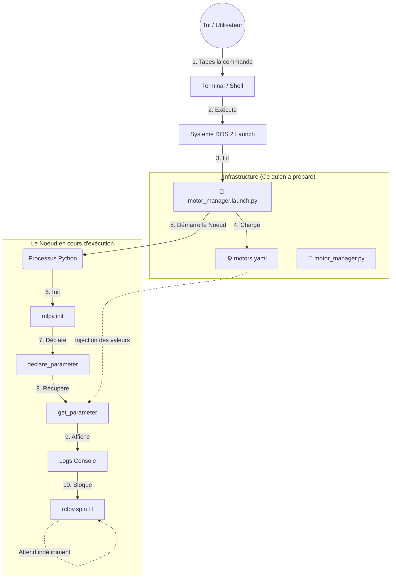

# Explication du Flux de Lancement ROS 2

Ce document explique, étape par étape, ce qui se passe lorsque vous exécutez la commande `ros2 launch`.

## 👨‍🏫 Analyse du Schéma Étape par Étape

1.  **L'Utilisateur lance la commande** : Tu tapes `ros2 launch ...` dans le terminal. C'est le point de départ.
2.  **ROS 2 prend le contrôle** : Le système `ros2 launch` interprète le fichier de lancement que tu lui as donné.
3.  **Lecture du plan de lancement** : Le système lit ton fichier `.launch.py` qui décrit quels nœuds démarrer et avec quelle configuration.
4.  **Chargement de la configuration** : Le script de lancement charge en mémoire le contenu du fichier `.yaml`.
5.  **Démarrage du Nœud** : Le système de lancement démarre ton script Python (`motor_manager.py`) et lui transmet les paramètres du YAML.
6.  **Initialisation ROS** : `rclpy.init()` connecte ton programme à l'écosystème ROS 2.
7.  **Déclaration des Paramètres** : `self.declare_parameter(...)` informe ROS 2 que ton nœud accepte des configurations spécifiques.
8.  **Récupération des Valeurs** : `self.get_parameter(...)` lit les valeurs injectées depuis le YAML et les stocke dans des variables.
9.  **Affichage des Logs** : `self.get_logger().info(...)` permet de vérifier que la configuration a été chargée correctement.
10. **La Boucle d'Attente (`spin`)** : `rclpy.spin(node)` met le nœud en "mode écoute" infinie, en attente d'événements ROS 2. C'est pourquoi le programme ne se termine pas seul.