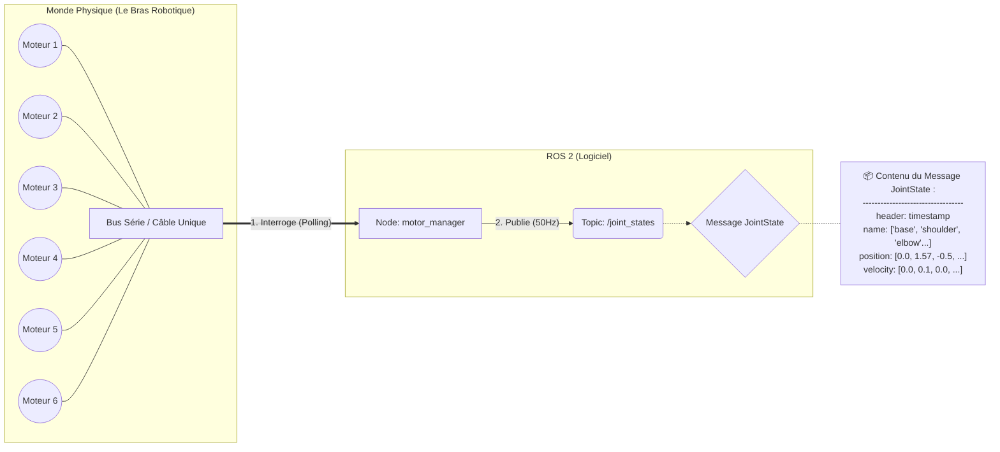

# Explication de l'Architecture du Driver Moteur

Ce document explique comment notre nœud `motor_manager` gère l'ensemble des 6 moteurs du bras robotique.

## 👨‍🏫 Analyse du Schéma

Le concept clé est celui du **Driver Centralisé**. Au lieu d'avoir un programme par moteur (ce qui serait inefficace et créerait des conflits), nous avons un seul nœud qui agit comme un chef d'orchestre.

1.  **Communication Unique** : Le nœud `motor_manager` ouvre le port série (le câble USB) une seule et unique fois. Il est le seul à avoir le droit de communiquer avec le matériel.

2.  **Interrogation Séquentielle (Polling)** : À une fréquence régulière (définie par `loop_rate` dans notre config), le nœud interroge les moteurs les uns après les autres sur le bus série. Il demande à chaque moteur sa position actuelle.

3.  **Agrégation des Données** : Le nœud rassemble toutes les positions reçues dans un seul et unique message ROS 2 de type `sensor_msgs/msg/JointState`.

4.  **Publication Unique** : Ce message `JointState` est publié sur le topic `/joint_states`. Comme le montre la note, ce message contient des listes (arrays). La liste `position` contiendra les 6 angles de nos 6 moteurs, dans un ordre défini. N'importe quel autre nœud dans l'écosystème ROS 2 peut alors connaître l'état de tout le robot en écoutant simplement ce seul topic.