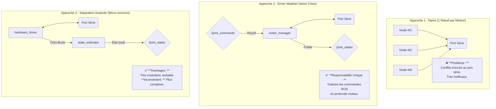

# Explication de la Séparation des Nœuds

La force d'un bon intégrateur ROS 2 réside dans sa capacité à bien découper un problème complexe en plusieurs nœuds simples, chacun avec une seule responsabilité.

## 👨‍🏫 Analyse des Architectures

1.  **Approche 1 (Naïve)** : Tenter de faire communiquer plusieurs programmes avec le même port physique simultanément est une recette pour le désastre. C'est un anti-pattern à éviter absolument.

2.  **Approche 2 (Driver Matériel)** : C'est l'architecture standard et la plus robuste pour notre cas. On crée une **Couche d'Abstraction Matérielle** (Hardware Abstraction Layer - HAL). Le nœud `motor_manager` a une seule responsabilité : cacher la complexité du protocole des moteurs Feetech au reste du système. Les autres nœuds (navigation, vision) n'ont pas besoin de savoir comment parler aux moteurs ; ils dialoguent en utilisant les topics ROS standards (`/joint_states`, `/joint_commands`). Si on change de marque de moteurs, seul ce nœud doit être réécrit.

3.  **Approche 3 (Avancée)** : Pour des robots très complexes (humanoïdes, rovers spatiaux), on peut pousser la logique plus loin. Un nœud lit les données brutes du bus, un deuxième les filtre et les convertit, un troisième gère la boucle de contrôle (PID), etc. C'est une architecture en micro-services, très puissante mais souvent trop complexe pour des projets de taille moyenne.