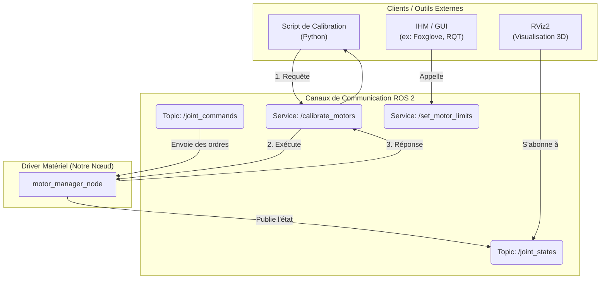

# Explication des Interfaces avec le Driver

Un driver bien conçu ne contient aucune interface utilisateur (IHM). Il se comporte comme une API, exposant des points d'accès que des outils externes (clients) peuvent utiliser.

## 👨‍🏫 Analyse du Schéma

Le driver `motor_manager` est un serviteur qui ne fait que ce qu'on lui demande via les canaux ROS 2. Les outils de diagnostic et de contrôle sont des **clients** qui consomment les services et les données qu'il expose.

1.  **Topics (Flux de données)** : Le driver publie en continu l'état des moteurs sur `/joint_states`. Des outils comme **RViz2** peuvent s'abonner à ce topic pour afficher un modèle 3D du robot en temps réel. Il écoute aussi sur `/joint_commands` pour recevoir des ordres de mouvement.

2.  **Services (Actions ponctuelles)** : Pour des actions qui ne sont pas continues (comme "calibrer" ou "fixer une limite"), on utilise un **Service**. C'est une communication de type **Requête/Réponse**.
    *   Un **script de calibration** (un simple programme Python) est lancé. Il appelle le service `/calibrate_motors`.
    *   Le driver reçoit la requête, exécute la procédure de calibration, puis renvoie une réponse ("Succès" ou "Échec").
    *   Le script client reçoit la réponse, l'affiche, et se termine.

Cette architecture rend le driver totalement indépendant de toute interface graphique, ce qui le rend extrêmement modulaire, testable et réutilisable.