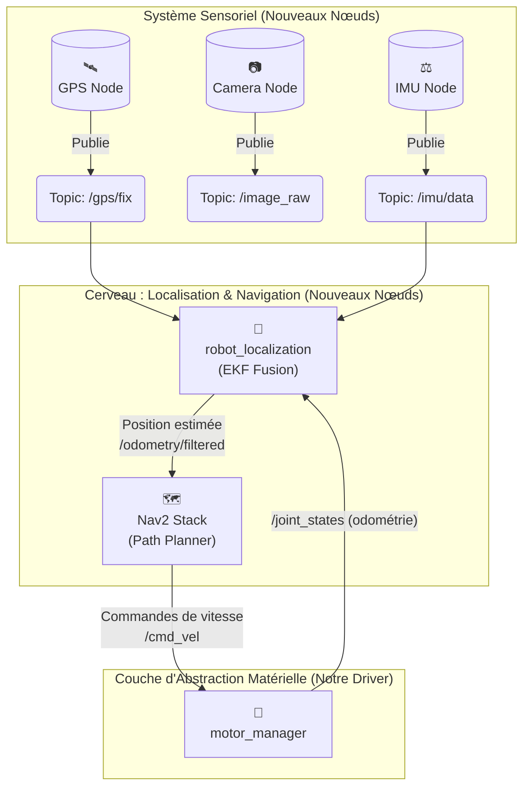

# Explication de l'Architecture d'un Robot Autonome

Pour rendre un robot autonome, on ne modifie pas les couches basses (comme notre driver moteur), on leur ajoute des couches de perception et de décision.

## 👨‍🏫 Analyse du Schéma

1.  **Système Sensoriel** : On ajoute des nœuds dédiés pour chaque capteur (GPS, Caméra, IMU). Chaque nœud a une seule responsabilité : lire les données brutes de son capteur et les publier sur un topic ROS 2.

2.  **Localisation (Où suis-je ?)** : C'est le premier étage du cerveau. Un nœud spécialisé comme `robot_localization` utilise des algorithmes de **fusion de capteurs** (souvent un Filtre de Kalman Étendu - EKF) pour combiner les données imparfaites de plusieurs sources (GPS, IMU, odométrie des roues) et produire une estimation de la position du robot qui soit la plus fiable et stable possible.

3.  **Navigation (Comment j'y vais ?)** : C'est le chef d'orchestre de l'autonomie. La stack de navigation standard de ROS 2, **Nav2**, prend en entrée la position fiable du robot, une carte de l'environnement et un objectif. Elle calcule alors la meilleure trajectoire pour éviter les obstacles et atteindre le but. Pour ce faire, elle publie des commandes de vitesse (ex: "avance à 0.5 m/s") sur le topic `/cmd_vel`.

4.  **Rôle de notre Driver** : Dans cette architecture, notre `motor_manager` a un double rôle :
    *   Il continue de publier l'état des moteurs (`/joint_states`), qui est utilisé par le nœud de localisation comme une source d'information sur le déplacement du robot (odométrie).
    *   Il doit s'abonner au topic `/cmd_vel` publié par Nav2 et traduire ces commandes de vitesse génériques en ordres de rotation spécifiques pour chaque moteur du bras ou des roues.