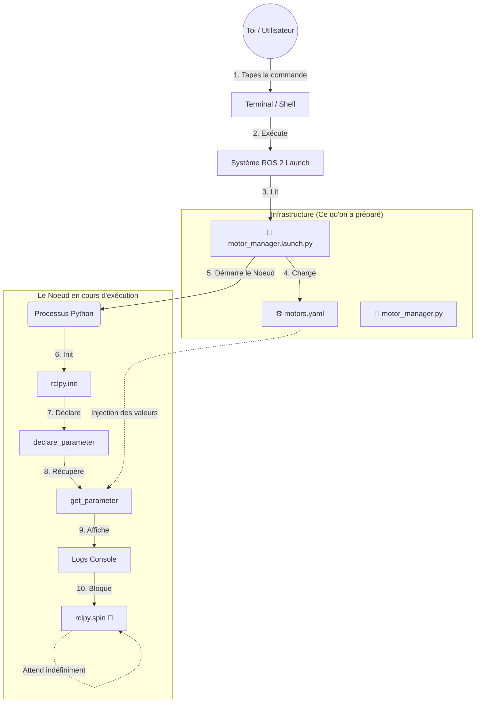

```mermaid
graph TD
    User((Toi / Utilisateur)) -->|1. Tapes la commande| Terminal[Terminal / Shell]
    Terminal -->|2. Exécute| ROS2_Launch[Système ROS 2 Launch]
    
    subgraph "Infrastructure (Ce qu'on a préparé)"
        LaunchFile["📄 motor_manager.launch.py"]
        YAML["⚙️ motors.yaml"]
        PythonCode["🐍 motor_manager.py"]
    end

    ROS2_Launch -->|3. Lit| LaunchFile
    LaunchFile -->|4. Charge| YAML
    LaunchFile -->|5. Démarre le Noeud| NodeProcess(Processus Python)

    subgraph "Le Noeud en cours d'exécution"
        NodeProcess -->|6. Init| Init[rclpy.init]
        Init -->|7. Déclare| Params[declare_parameter]
        Params -->|8. Récupère| GetParams[get_parameter]
        YAML -.->|Injection des valeurs| GetParams
        GetParams -->|9. Affiche| Logs[Logs Console]
        Logs -->|10. Bloque| Spin[rclpy.spin 🔄]
    end

    Spin -.->|Attend indéfiniment| Spin
```